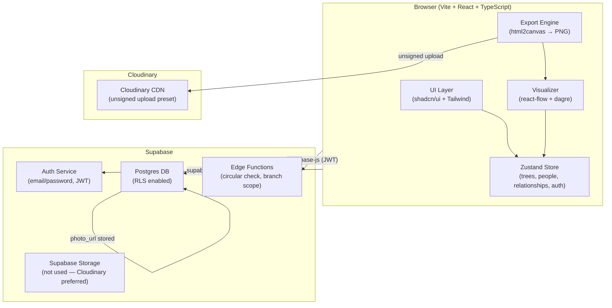
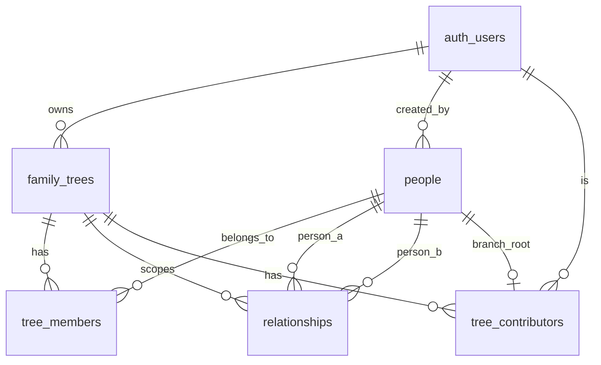

# Design Document: Family Tree Application

## Overview

A full-generational family tree builder built on React + TypeScript (Vite), Supabase (Postgres + Auth + RLS + Edge Functions), Cloudinary (media), and Vercel (hosting). Users create named family trees, add people with biographical data and photos, define typed relationships, and visualize the result as an interactive graph powered by react-flow and dagre layout.

Key design goals:
- Correctness: circular ancestry prevention, duplicate relationship guards, RLS on every table
- Collaboration: branch-scoped contributor permissions enforced at both RLS and application layers
- Shareability: public tree URLs, generation snapshot export via html2canvas → Cloudinary → Web Share API
- Performance: BFS cycle detection completes in O(V+E) time; dagre layout runs client-side on the rendered subgraph

---

## Architecture



### Deployment

| Layer | Platform |
|---|---|
| Frontend | Vercel (static, edge CDN) |
| Database + Auth | Supabase (hosted Postgres) |
| Edge Functions | Supabase Edge Functions (Deno) |
| Media | Cloudinary (unsigned upload preset) |

---

## Components and Interfaces

### Component Hierarchy

```
App
├── AuthProvider          (Supabase session context)
├── ThemeProvider         (dark/light mode via Tailwind class)
├── Router
│   ├── /login            → AuthPage
│   ├── /register         → AuthPage
│   ├── /trees            → TreeListPage
│   │   └── TreeCard
│   ├── /trees/:treeId    → TreePage
│   │   ├── TreeToolbar   (add person, add relationship, share, export)
│   │   ├── FamilyTreeCanvas  (react-flow wrapper)
│   │   │   ├── PersonNode    (custom react-flow node)
│   │   │   └── RelationshipEdge (custom react-flow edge)
│   │   ├── PersonDetailPanel (slide-over, shown on node click)
│   │   ├── AddPersonModal
│   │   ├── AddRelationshipModal
│   │   ├── ContributorModal
│   │   └── ShareExportModal
│   └── /trees/:treeId/public → PublicTreePage (read-only, no auth required)
```

### Key Component Interfaces

```typescript
// PersonNode props (react-flow custom node)
interface PersonNodeData {
  personId: string;
  fullName: string;
  photoUrl: string | null;
  gender: 'male' | 'female' | 'other' | null;
  birthDate: string | null;
  deathDate: string | null;
  isSelected: boolean;
}

// RelationshipEdge props (react-flow custom edge)
interface RelationshipEdgeData {
  relationshipId: string;
  relationshipType: 'parent_child' | 'spouse' | 'sibling' | 'extramarital';
  isBiological: boolean;
  marriedOn: string | null;
  divorcedOn: string | null;
}

// Zustand store slices
interface TreeStore {
  currentTree: FamilyTree | null;
  people: Person[];
  relationships: Relationship[];
  contributors: Contributor[];
  setCurrentTree: (tree: FamilyTree) => void;
  upsertPerson: (person: Person) => void;
  removePerson: (personId: string) => void;
  upsertRelationship: (rel: Relationship) => void;
  removeRelationship: (relId: string) => void;
}
```

### Service Layer (Supabase client hooks)

All data access goes through typed React hooks that wrap `supabase-js`:

| Hook | Responsibility |
|---|---|
| `useAuth()` | register, login, logout, session |
| `useTrees()` | CRUD on family_trees |
| `usePeople(treeId)` | CRUD on people within a tree |
| `useRelationships(treeId)` | CRUD on relationships within a tree |
| `useContributors(treeId)` | invite/remove contributors |
| `usePhotoUpload()` | Cloudinary unsigned upload |
| `useTreeExport(treeId)` | html2canvas → Cloudinary → share URL |

---

## Data Models

### Full Database Schema (SQL)

```sql
-- Enable UUID extension
create extension if not exists "pgcrypto";

-- ─────────────────────────────────────────
-- PEOPLE
-- ─────────────────────────────────────────
create table people (
  id            uuid primary key default gen_random_uuid(),
  full_name     text not null,
  birth_date    date,
  death_date    date,
  bio           text,
  gender        text check (gender in ('male','female','other')),
  photo_url     text,
  cloudinary_public_id text,          -- for deletion on Cloudinary
  created_by    uuid not null references auth.users(id) on delete cascade,
  created_at    timestamptz not null default now(),
  updated_at    timestamptz not null default now(),
  constraint death_after_birth check (
    death_date is null or birth_date is null or death_date >= birth_date
  )
);

-- ─────────────────────────────────────────
-- FAMILY TREES
-- ─────────────────────────────────────────
create table family_trees (
  id          uuid primary key default gen_random_uuid(),
  name        text not null,
  owner_id    uuid not null references auth.users(id) on delete cascade,
  is_public   boolean not null default false,
  created_at  timestamptz not null default now(),
  updated_at  timestamptz not null default now(),
  unique (owner_id, name)             -- unique name per owner (Req 6.2)
);

-- ─────────────────────────────────────────
-- TREE MEMBERS  (person ↔ tree join)
-- ─────────────────────────────────────────
create table tree_members (
  id         uuid primary key default gen_random_uuid(),
  tree_id    uuid not null references family_trees(id) on delete cascade,
  person_id  uuid not null references people(id) on delete cascade,
  added_at   timestamptz not null default now(),
  unique (tree_id, person_id)
);

-- ─────────────────────────────────────────
-- RELATIONSHIPS
-- ─────────────────────────────────────────
create type relationship_type as enum (
  'parent_child', 'spouse', 'sibling', 'extramarital'
);

create table relationships (
  id                uuid primary key default gen_random_uuid(),
  tree_id           uuid not null references family_trees(id) on delete cascade,
  person_a_id       uuid not null references people(id) on delete cascade,
  person_b_id       uuid not null references people(id) on delete cascade,
  relationship_type relationship_type not null,
  is_biological     boolean not null default true,
  married_on        date,
  divorced_on       date,
  created_by        uuid not null references auth.users(id) on delete cascade,
  created_at        timestamptz not null default now(),
  -- no self-relationships (Req 10.3)
  constraint no_self_relationship check (person_a_id <> person_b_id),
  -- no duplicate relationships (Req 10.4, 11.7)
  unique (tree_id, person_a_id, person_b_id, relationship_type),
  -- divorced_on must be after married_on (Req 4.4)
  constraint divorce_after_marriage check (
    divorced_on is null or married_on is null or divorced_on >= married_on
  )
);

-- ─────────────────────────────────────────
-- TREE CONTRIBUTORS
-- ─────────────────────────────────────────
create type contributor_role as enum ('owner', 'editor', 'viewer');

create table tree_contributors (
  id                   uuid primary key default gen_random_uuid(),
  tree_id              uuid not null references family_trees(id) on delete cascade,
  user_id              uuid not null references auth.users(id) on delete cascade,
  role                 contributor_role not null,
  branch_root_person_id uuid references people(id) on delete set null,
  invited_at           timestamptz not null default now(),
  unique (tree_id, user_id)
);
```

### Entity Relationship Diagram



### TypeScript Domain Types

```typescript
export type RelationshipType = 'parent_child' | 'spouse' | 'sibling' | 'extramarital';
export type ContributorRole = 'owner' | 'editor' | 'viewer';

export interface Person {
  id: string;
  fullName: string;
  birthDate: string | null;
  deathDate: string | null;
  bio: string | null;
  gender: 'male' | 'female' | 'other' | null;
  photoUrl: string | null;
  cloudinaryPublicId: string | null;
  createdBy: string;
  createdAt: string;
}

export interface FamilyTree {
  id: string;
  name: string;
  ownerId: string;
  isPublic: boolean;
  createdAt: string;
}

export interface Relationship {
  id: string;
  treeId: string;
  personAId: string;
  personBId: string;
  relationshipType: RelationshipType;
  isBiological: boolean;
  marriedOn: string | null;
  divorcedOn: string | null;
}

export interface Contributor {
  id: string;
  treeId: string;
  userId: string;
  role: ContributorRole;
  branchRootPersonId: string | null;
}
```

---

## RLS Policy Designs

All tables have RLS enabled. Policies follow the principle of least privilege.

### `family_trees`

```sql
alter table family_trees enable row level security;

-- owners can do everything
create policy "owner full access" on family_trees
  for all using (owner_id = auth.uid());

-- public trees are readable by anyone (including anon)
create policy "public read" on family_trees
  for select using (is_public = true);

-- contributors can read trees they are invited to
create policy "contributor read" on family_trees
  for select using (
    exists (
      select 1 from tree_contributors tc
      where tc.tree_id = id and tc.user_id = auth.uid()
    )
  );
```

### `people`

```sql
alter table people enable row level security;

-- creator can always read/write their own records
create policy "creator access" on people
  for all using (created_by = auth.uid());

-- contributors with editor/owner role can modify
create policy "contributor write" on people
  for all using (
    exists (
      select 1 from tree_members tm
      join tree_contributors tc on tc.tree_id = tm.tree_id
      where tm.person_id = id
        and tc.user_id = auth.uid()
        and tc.role in ('owner','editor')
    )
  );

-- viewers and public trees: read-only
create policy "viewer read" on people
  for select using (
    exists (
      select 1 from tree_members tm
      join family_trees ft on ft.id = tm.tree_id
      left join tree_contributors tc on tc.tree_id = tm.tree_id and tc.user_id = auth.uid()
      where tm.person_id = id
        and (ft.is_public = true or tc.user_id is not null)
    )
  );
```

### `relationships`

```sql
alter table relationships enable row level security;

-- editor/owner contributors can write
create policy "contributor write" on relationships
  for all using (
    exists (
      select 1 from tree_contributors tc
      where tc.tree_id = relationships.tree_id
        and tc.user_id = auth.uid()
        and tc.role in ('owner','editor')
    )
  );

-- viewers and public trees: read-only
create policy "viewer or public read" on relationships
  for select using (
    exists (
      select 1 from family_trees ft
      left join tree_contributors tc on tc.tree_id = ft.id and tc.user_id = auth.uid()
      where ft.id = relationships.tree_id
        and (ft.is_public = true or tc.user_id is not null)
    )
  );
```

### `tree_members`

```sql
alter table tree_members enable row level security;

-- owner can manage membership
create policy "owner manage" on tree_members
  for all using (
    exists (
      select 1 from family_trees ft
      where ft.id = tree_id and ft.owner_id = auth.uid()
    )
  );

-- contributors and public: read
create policy "contributor or public read" on tree_members
  for select using (
    exists (
      select 1 from family_trees ft
      left join tree_contributors tc on tc.tree_id = ft.id and tc.user_id = auth.uid()
      where ft.id = tree_id
        and (ft.is_public = true or tc.user_id is not null)
    )
  );
```

### `tree_contributors`

```sql
alter table tree_contributors enable row level security;

-- only tree owner can manage contributors (Req 7.8)
create policy "owner manages contributors" on tree_contributors
  for all using (
    exists (
      select 1 from family_trees ft
      where ft.id = tree_id and ft.owner_id = auth.uid()
    )
  );

-- contributors can read their own record
create policy "self read" on tree_contributors
  for select using (user_id = auth.uid());
```

---

## Cloudinary Integration Design

### Upload Flow

Direct unsigned upload from the browser using a Cloudinary upload preset. No server-side proxy needed.

```
Browser
  → POST https://api.cloudinary.com/v1_1/{cloud_name}/image/upload
    { file, upload_preset: "family_tree_unsigned", folder: "family-tree/people" }
  ← { secure_url, public_id }
  → PATCH /people/:id  { photo_url: secure_url, cloudinary_public_id: public_id }
```

### Constraints enforced client-side before upload
- Max file size: 5 MB (Req 3.3)
- Accepted MIME types: `image/jpeg`, `image/png`, `image/webp` (Req 3.2)

### Deletion Flow

When a Person is deleted (Req 3.6), a Supabase Edge Function is triggered via a Postgres `AFTER DELETE` trigger on the `people` table. The function calls the Cloudinary Admin API to delete the asset by `cloudinary_public_id`.

```
Postgres trigger (after delete on people)
  → Supabase Edge Function: delete-cloudinary-asset
    → Cloudinary Admin API DELETE /resources/image/upload/:public_id
```

### Generation Snapshot Upload (Req 12)

```
html2canvas(canvasElement) → Blob (PNG)
  → POST https://api.cloudinary.com/v1_1/{cloud_name}/image/upload
    { file: blob, upload_preset: "family_tree_snapshots", folder: "family-tree/snapshots" }
  ← { secure_url }
  → Web Share API / platform links using secure_url
```

---

## Tree Builder Algorithm (Relationships → react-flow)

### Overview

The `buildGraphFromRelationships` function converts flat arrays of `Person[]` and `Relationship[]` into react-flow `Node[]` and `Edge[]`, then applies dagre layout.

```typescript
function buildGraphFromRelationships(
  people: Person[],
  relationships: Relationship[],
  options: { centerPersonId?: string }
): { nodes: Node<PersonNodeData>[]; edges: Edge<RelationshipEdgeData>[] }
```

### Step-by-step

1. **Create nodes** — one `Node` per `Person`, initial position `{x:0, y:0}`.
2. **Create edges** — one `Edge` per `Relationship`. Edge `type` maps to a custom edge component keyed by `relationship_type`.
3. **Apply dagre layout**:
   ```typescript
   const g = new dagre.graphlib.Graph();
   g.setGraph({ rankdir: 'TB', nodesep: 80, ranksep: 120 });
   nodes.forEach(n => g.setNode(n.id, { width: 160, height: 80 }));
   // Only parent_child edges drive the hierarchy
   relationships
     .filter(r => r.relationshipType === 'parent_child')
     .forEach(r => g.setEdge(r.personAId, r.personBId));
   dagre.layout(g);
   // Copy computed positions back to react-flow nodes
   nodes.forEach(n => {
     const { x, y } = g.node(n.id);
     n.position = { x: x - 80, y: y - 40 };
   });
   ```
4. **Center viewport** — if `centerPersonId` is provided and the tree has >50 nodes, `reactFlowInstance.setCenter(x, y)` on that node's position.
5. **Return** `{ nodes, edges }` to be passed directly to `<ReactFlow>`.

### Edge Style Mapping

| relationship_type | Line style | Color |
|---|---|---|
| `parent_child` | solid | `#6366f1` (indigo) |
| `spouse` | double | `#ec4899` (pink) |
| `sibling` | dashed | `#22c55e` (green) |
| `extramarital` | dotted | `#f97316` (orange) |

---

## Circular Relationship Prevention Algorithm

### Scope

Only `parent_child` relationships can form ancestry cycles (Req 5.4). The check runs client-side before the insert is sent to Supabase, and is also enforced in a Supabase Edge Function for server-side safety.

### Algorithm (BFS)

```typescript
/**
 * Returns true if adding edge (parentId → childId) would create a cycle
 * in the existing parent_child graph.
 *
 * Strategy: if childId is already an ancestor of parentId, adding this
 * edge would create a cycle.
 */
function wouldCreateCycle(
  parentId: string,
  childId: string,
  relationships: Relationship[]
): boolean {
  // Build adjacency: child → [parents]
  const parentOf = new Map<string, string[]>();
  for (const r of relationships) {
    if (r.relationshipType !== 'parent_child') continue;
    const children = parentOf.get(r.personAId) ?? [];
    children.push(r.personBId);
    parentOf.set(r.personAId, children);
  }

  // BFS upward from parentId — if we reach childId, it's a cycle
  const visited = new Set<string>();
  const queue: string[] = [parentId];
  while (queue.length > 0) {
    const current = queue.shift()!;
    if (current === childId) return true;
    if (visited.has(current)) continue;
    visited.add(current);
    for (const ancestor of (parentOf.get(current) ?? [])) {
      queue.push(ancestor);
    }
  }
  return false;
}
```

### Complexity

- Time: O(V + E) where V = people in tree, E = parent_child relationships
- Space: O(V) for the visited set
- Meets the 2-second requirement for trees up to 10,000 nodes (Req 5.3)

### Server-side guard (Edge Function)

The `create-relationship` Edge Function repeats the same BFS using a Postgres recursive CTE before committing the insert:

```sql
-- Detect cycle: is proposed_child already an ancestor of proposed_parent?
with recursive ancestors as (
  select person_a_id as person_id
  from relationships
  where person_b_id = $proposed_parent_id
    and relationship_type = 'parent_child'
    and tree_id = $tree_id
  union all
  select r.person_a_id
  from relationships r
  join ancestors a on r.person_b_id = a.person_id
  where r.relationship_type = 'parent_child'
    and r.tree_id = $tree_id
)
select exists (select 1 from ancestors where person_id = $proposed_child_id);
```

---

## Branch Permission Enforcement Design

### Concept

A contributor with `branch_root_person_id = X` may only write to Person and Relationship records that are reachable from X via `parent_child` edges (descendants of X, inclusive).

### Branch Computation

```typescript
function getBranchDescendants(
  rootPersonId: string,
  relationships: Relationship[]
): Set<string> {
  const childrenOf = new Map<string, string[]>();
  for (const r of relationships) {
    if (r.relationshipType !== 'parent_child') continue;
    const list = childrenOf.get(r.personAId) ?? [];
    list.push(r.personBId);
    childrenOf.set(r.personAId, list);
  }

  const result = new Set<string>([rootPersonId]);
  const queue = [rootPersonId];
  while (queue.length > 0) {
    const current = queue.shift()!;
    for (const child of (childrenOf.get(current) ?? [])) {
      if (!result.has(child)) {
        result.add(child);
        queue.push(child);
      }
    }
  }
  return result;
}
```

### Enforcement Points

1. **Client-side** — `usePeople` and `useRelationships` hooks check branch scope before calling Supabase. Operations outside scope are rejected with a UI error before any network call.
2. **Edge Function** — `create-person`, `update-person`, `create-relationship` Edge Functions re-derive the branch set server-side and return 403 if the target person is outside scope.
3. **RLS** — RLS policies grant write access to editor/owner roles broadly; the branch restriction is an application-layer concern layered on top.

### Branch Root Deletion (Req 10.5)

A Postgres trigger on `tree_members` (`AFTER DELETE`) checks if any `tree_contributors.branch_root_person_id` references the deleted person. If so, it sets `branch_root_person_id = null` and inserts a notification row into a `notifications` table for the tree owner.

---

## Social Media Sharing + Image Export Design

### Generation Snapshot Export Flow

```
1. User selects generation N or branch root B in ShareExportModal
2. FamilyTreeCanvas filters nodes/edges to the selected scope
3. html2canvas(canvasRef.current, { useCORS: true, scale: 2 }) → HTMLCanvasElement
4. canvas.toBlob('image/png') → Blob
5. Upload Blob to Cloudinary (unsigned, "family_tree_snapshots" preset) → secure_url
6. Present sharing options:
   a. Web Share API (navigator.share({ url: secure_url, title: "My Family Tree" }))
   b. Fallback: Facebook, Twitter/X, WhatsApp platform links + copy-to-clipboard
```

### Platform Share URL Templates

```typescript
const shareUrls = {
  facebook: `https://www.facebook.com/sharer/sharer.php?u=${encodeURIComponent(imageUrl)}`,
  twitter:  `https://twitter.com/intent/tweet?url=${encodeURIComponent(imageUrl)}&text=My+Family+Tree`,
  whatsapp: `https://wa.me/?text=${encodeURIComponent('My Family Tree ' + imageUrl)}`,
};
```

### Generation Selection

Generation 1 = root person (tree owner's associated person). Generation N = all people at BFS depth N-1 from the root.

```typescript
function getPeopleAtGeneration(
  rootPersonId: string,
  targetGeneration: number,
  relationships: Relationship[]
): string[] {
  const childrenOf = buildChildrenMap(relationships);
  let current = new Set([rootPersonId]);
  for (let gen = 1; gen < targetGeneration; gen++) {
    const next = new Set<string>();
    for (const p of current) {
      for (const child of (childrenOf.get(p) ?? [])) next.add(child);
    }
    current = next;
  }
  return [...current];
}
```

### Auth Guard (Req 12.4 / 12.5)

- Private tree: export endpoint requires valid JWT; Supabase RLS blocks unauthenticated reads.
- Public tree: export is allowed without auth; Cloudinary upload uses the unsigned preset.

---

## UI/UX Design Notes

### Color Palette

| Token | Light | Dark |
|---|---|---|
| Background | `#f8fafc` (slate-50) | `#0f172a` (slate-900) |
| Surface | `#ffffff` | `#1e293b` (slate-800) |
| Primary | `#6366f1` (indigo-500) | `#818cf8` (indigo-400) |
| Accent | `#ec4899` (pink-500) | `#f472b6` (pink-400) |
| Success | `#22c55e` (green-500) | `#4ade80` (green-400) |
| Warning | `#f97316` (orange-500) | `#fb923c` (orange-400) |
| Text primary | `#0f172a` | `#f1f5f9` |
| Text muted | `#64748b` | `#94a3b8` |

### Layout

- Desktop: sidebar (tree list, 280px) + main canvas (flex-1) + slide-over detail panel (400px)
- Mobile: bottom sheet for detail panel; canvas fills viewport; toolbar collapses to FAB

### Animations

- Node add: scale-in from 0 → 1 (150ms ease-out)
- Edge draw: stroke-dashoffset animation (300ms)
- Detail panel: slide-in from right (200ms ease-in-out)
- Dark/light toggle: `transition-colors duration-200` on root element

### Accessibility

- All interactive nodes have `role="button"` and `aria-label="{fullName}"`
- Keyboard navigation: Tab through nodes, Enter to open detail panel
- Color is never the sole differentiator — edge types also differ in stroke pattern

---

## Correctness Properties

*A property is a characteristic or behavior that should hold true across all valid executions of a system — essentially, a formal statement about what the system should do. Properties serve as the bridge between human-readable specifications and machine-verifiable correctness guarantees.*

### Property 1: Registration rejects invalid credentials

*For any* registration attempt with a password shorter than 8 characters, or with an email address already registered in the system, the Auth_Service should reject the request and return an appropriate error without creating a new account.

**Validates: Requirements 1.1, 1.3**

---

### Property 2: Registration round-trip

*For any* valid email and password (≥ 8 characters, not previously registered), submitting a registration request should result in a new account being created and a session token being returned.

**Validates: Requirements 1.2**

---

### Property 3: Login error does not reveal field specificity

*For any* login attempt with an invalid email or invalid password, the error message returned by the Auth_Service should be identical regardless of which field is incorrect.

**Validates: Requirements 1.5**

---

### Property 4: Person creation and retrieval round-trip

*For any* valid person record (with full_name present, death_date ≥ birth_date when both provided), creating the person and then fetching it by ID should return a record whose fields exactly match the submitted values.

**Validates: Requirements 2.1, 2.2, 2.4**

---

### Property 5: Partial person update preserves unchanged fields

*For any* existing person and any non-empty subset of updatable fields, submitting an update with only those fields should change exactly those fields and leave all other fields unchanged.

**Validates: Requirements 2.5**

---

### Property 6: Death-before-birth rejected

*For any* (birth_date, death_date) pair where death_date is strictly earlier than birth_date, the People_Service should reject the create or update request with a validation error.

**Validates: Requirements 2.6**

---

### Property 7: Person deletion cascades to relationships

*For any* person who is referenced in one or more Relationship records, deleting that person should result in all associated Relationship records also being deleted, while all other Person records remain intact.

**Validates: Requirements 2.7**

---

### Property 8: Unauthorized users cannot modify person records

*For any* person record and any user who is neither the record's creator nor an editor/owner contributor on the associated Family_Tree, any write operation (create, update, delete) on that record should be rejected by RLS.

**Validates: Requirements 2.8, 10.1**

---

### Property 9: Photo upload format validation

*For any* file whose MIME type is not `image/jpeg`, `image/png`, or `image/webp`, the Photo_Service should reject the upload and return a format error without uploading anything to Cloudinary.

**Validates: Requirements 3.2, 3.4**

---

### Property 10: Photo upload size validation

*For any* file whose size exceeds 5 MB, the Photo_Service should reject the upload and return a file-size error before any network call to Cloudinary is made.

**Validates: Requirements 3.3**

---

### Property 11: Relationship creation round-trip

*For any* valid relationship between two distinct persons in the same Family_Tree (with divorced_on ≥ married_on when both provided), creating the relationship and then fetching it should return a record whose type, is_biological, married_on, and divorced_on fields exactly match the submitted values.

**Validates: Requirements 4.2**

---

### Property 12: Circular parent_child relationship rejected

*For any* existing parent_child graph and any proposed (parentId, childId) edge that would make childId an ancestor of parentId, the Relationship_Service should reject the creation request and return a circular-relationship error.

**Validates: Requirements 4.3, 5.1, 5.2**

---

### Property 13: Divorce-before-marriage rejected

*For any* (married_on, divorced_on) pair where divorced_on is strictly earlier than married_on, the Relationship_Service should reject the relationship creation or update with a validation error.

**Validates: Requirements 4.4**

---

### Property 14: Multiple simultaneous spouse relationships allowed

*For any* person, creating two or more spouse-type Relationship records linking that person to different individuals should all succeed without any being rejected due to the number of spouse relationships.

**Validates: Requirements 4.5**

---

### Property 15: Relationship deletion does not affect persons

*For any* relationship between Person A and Person B, deleting that relationship should remove only the Relationship record while leaving both Person A and Person B records fully intact.

**Validates: Requirements 4.6**

---

### Property 16: Cross-tree relationships rejected

*For any* two persons who belong to different Family_Trees, attempting to create a Relationship record linking them should be rejected with an error.

**Validates: Requirements 4.8**

---

### Property 17: Sibling and spouse relationships skip cycle check

*For any* graph (regardless of complexity) and any proposed sibling or spouse relationship, the creation should never be rejected due to a circular-relationship error.

**Validates: Requirements 5.4**

---

### Property 18: Cycle detection performance

*For any* parent_child graph containing up to 10,000 Person records, the `wouldCreateCycle` function should complete within 2 seconds.

**Validates: Requirements 5.3**

---

### Property 19: Family_Tree creation round-trip

*For any* valid tree name unique to the owner, creating a Family_Tree and fetching it should return a record with the correct name, owner_id, and is_public defaulting to false.

**Validates: Requirements 6.1**

---

### Property 20: Duplicate tree name per owner rejected

*For any* owner who already has a Family_Tree with a given name, attempting to create a second Family_Tree with the same name should be rejected.

**Validates: Requirements 6.2**

---

### Property 21: Tree membership round-trip

*For any* person and Family_Tree, adding the person to the tree should create a Tree_Member record; attempting to add the same person again should return a duplicate-member error.

**Validates: Requirements 6.3, 6.4**

---

### Property 22: Person removal cascades relationships within tree

*For any* person who is a member of a Family_Tree and has Relationship records within that tree, removing the person from the tree should delete all those Relationship records while leaving the person's records in other trees unaffected.

**Validates: Requirements 6.5**

---

### Property 23: Public tree allows unauthenticated reads and rejects unauthenticated writes

*For any* Family_Tree with is_public = true, unauthenticated requests to read Person, Relationship, and Tree_Member records should succeed; unauthenticated write requests should be rejected.

**Validates: Requirements 6.6, 9.1, 9.2, 9.3**

---

### Property 24: Family_Tree deletion cascades all associated records

*For any* Family_Tree with associated Tree_Member, Contributor, and Relationship records, deleting the tree should result in all those associated records also being deleted.

**Validates: Requirements 6.7**

---

### Property 25: Only owner can delete tree or change is_public

*For any* Family_Tree and any user who is not the owner, attempts to delete the tree or change its is_public flag should be rejected by RLS.

**Validates: Requirements 6.8, 10.1**

---

### Property 26: Contributor invitation round-trip

*For any* tree owner, user, role, and optional branch_root_person_id, inviting that user should create a Contributor record with exactly those values.

**Validates: Requirements 7.2**

---

### Property 27: Branch-scoped contributor cannot write outside branch

*For any* contributor with a branch_root_person_id and any Person or Relationship record that is not a descendant of that branch root, any write operation by that contributor should be rejected.

**Validates: Requirements 7.3, 7.6**

---

### Property 28: Viewer role rejects all write operations

*For any* Family_Tree and any user with the viewer role on that tree, any create, update, or delete operation on Person or Relationship records in that tree should be rejected.

**Validates: Requirements 7.4**

---

### Property 29: Contributor removal revokes access

*For any* contributor record, removing it should result in the previously-invited user being unable to read or write any records in that Family_Tree (unless the tree is public).

**Validates: Requirements 7.7**

---

### Property 30: Only owner can manage contributors

*For any* Family_Tree and any user who is not the owner, attempts to create, update, or delete Contributor records for that tree should be rejected.

**Validates: Requirements 7.8, 10.1**

---

### Property 31: Graph node and edge counts match input

*For any* set of Person records and Relationship records, `buildGraphFromRelationships` should return exactly as many nodes as there are persons and exactly as many edges as there are relationships.

**Validates: Requirements 8.1**

---

### Property 32: Person node data completeness

*For any* Person record, the corresponding react-flow node's data should contain the person's full_name and either the photo_url or a non-null placeholder value.

**Validates: Requirements 8.2**

---

### Property 33: Edge style uniqueness per relationship type

*For any* two relationships of different types, their corresponding react-flow edges should have different style properties (strokeDasharray or color).

**Validates: Requirements 8.4, 11.4**

---

### Property 34: Large tree centers on owner's person

*For any* Family_Tree containing more than 50 Person records, the initial viewport center coordinates returned by the layout function should equal the position of the owner's associated Person node.

**Validates: Requirements 8.5**

---

### Property 35: Setting is_public to false immediately denies unauthenticated access

*For any* Family_Tree that was previously public, setting is_public to false should cause all subsequent unauthenticated read requests to return no rows.

**Validates: Requirements 9.4**

---

### Property 36: Shareable URL is stable and ID-based

*For any* Family_Tree, the shareable URL should contain the tree's ID and should remain unchanged after the tree's name is updated.

**Validates: Requirements 9.5**

---

### Property 37: Unauthenticated queries return no rows

*For any* RLS-protected table and any query executed without a valid session token, the result set should be empty (zero rows returned).

**Validates: Requirements 10.2**

---

### Property 38: Self-relationships rejected

*For any* person and any relationship type, attempting to create a Relationship record where person_a_id equals person_b_id should be rejected with a validation error.

**Validates: Requirements 10.3, 11.6**

---

### Property 39: Duplicate relationships rejected

*For any* existing Relationship record, attempting to create a second record with the same (tree_id, person_a_id, person_b_id, relationship_type) should be rejected.

**Validates: Requirements 10.4, 11.7**

---

### Property 40: Branch root nullified on person removal

*For any* Contributor record whose branch_root_person_id references a Person, removing that Person from the Family_Tree should set the Contributor's branch_root_person_id to null.

**Validates: Requirements 10.5**

---

### Property 41: Child can have parent_child links to both parents regardless of spouse relationship

*For any* child person and two parent persons (regardless of whether a spouse or extramarital relationship exists between the parents), creating parent_child Relationship records from each parent to the child should both succeed.

**Validates: Requirements 11.3**

---

### Property 42: Both biological parents appear as edges in graph

*For any* Person who has parent_child relationships to two parents (including via extramarital), `buildGraphFromRelationships` should produce edges connecting that person to both parents.

**Validates: Requirements 11.5**

---

### Property 43: Generation selection returns correct persons

*For any* tree and generation number N ≥ 1, `getPeopleAtGeneration(root, N)` should return exactly the set of persons at BFS depth N-1 from the root, and generation 1 should return exactly the root person.

**Validates: Requirements 12.7**

---

### Property 44: Share links contain encoded image URL

*For any* generated snapshot image URL, the Facebook, Twitter/X, and WhatsApp share link strings should each contain the URL-encoded form of the image URL.

**Validates: Requirements 12.2**

---

### Property 45: Web Share API fallback shown when unavailable

*For any* environment where `navigator.share` is undefined, the sharing UI should display platform-specific links and a copy-to-clipboard button rather than invoking the Web Share API.

**Validates: Requirements 12.3**

---

### Property 46: Export requires auth for private trees

*For any* Family_Tree with is_public = false, any attempt by an unauthenticated user to generate an export image should be rejected.

**Validates: Requirements 12.4**

---

### Property 47: Failed image generation shows error, no partial image

*For any* image generation attempt that results in an error (html2canvas rejection, Cloudinary upload failure), the UI should display an error message and the share modal should not present any image URL or share links.

**Validates: Requirements 12.6**

---

## Error Handling

### Client-side validation (before network calls)

| Scenario | Error type | User message |
|---|---|---|
| Missing full_name on person create | Validation | "Full name is required" |
| death_date < birth_date | Validation | "Death date cannot be before birth date" |
| divorced_on < married_on | Validation | "Divorce date cannot be before marriage date" |
| File > 5 MB | Validation | "Image must be under 5 MB" |
| Unsupported image format | Validation | "Only JPEG, PNG, and WebP images are supported" |
| Self-relationship | Validation | "A person cannot be related to themselves" |
| Duplicate relationship | Validation | "This relationship already exists" |
| Circular ancestry | Business rule | "This relationship would create a circular ancestry chain" |
| Cross-tree relationship | Business rule | "Both people must be in the same family tree" |
| Branch permission violation | Authorization | "You don't have permission to edit this part of the tree" |

### Server-side errors (Supabase / Edge Function responses)

All Edge Functions return a consistent error envelope:

```typescript
interface ApiError {
  code: string;       // e.g. "CIRCULAR_RELATIONSHIP", "DUPLICATE_RECORD"
  message: string;    // human-readable
  details?: unknown;  // optional structured context
}
```

HTTP status codes:
- `400` — validation errors
- `403` — RLS / permission errors
- `409` — duplicate record conflicts
- `422` — business rule violations (circular relationship, cross-tree)
- `500` — unexpected server errors

### Supabase RLS errors

When RLS blocks a query, `supabase-js` returns `{ error: { code: 'PGRST301', message: '...' } }`. The client maps this to a user-facing "Access denied" message and redirects to the login page if the session has expired.

### Cloudinary errors

Upload failures are caught in the `usePhotoUpload` hook and surfaced as toast notifications. The person record is not updated if the upload fails.

### Image export errors

`html2canvas` errors and Cloudinary upload failures during snapshot export are caught in `useTreeExport`. The share modal transitions to an error state showing the message from `ApiError`. No partial image URL is stored or displayed.

---

## Testing Strategy

### Dual Testing Approach

Both unit tests and property-based tests are required. They are complementary:
- Unit tests catch concrete bugs in specific scenarios and integration points
- Property-based tests verify universal correctness across the full input space

### Unit Tests

Focus areas:
- Specific examples: creating a person with all fields, creating each relationship type
- Integration points: Supabase hook responses mapped to Zustand store state
- Edge cases: empty tree empty-state, >50 node centering, Web Share API fallback
- Error conditions: each validation error path, RLS rejection handling

### Property-Based Testing

**Library**: `fast-check` (TypeScript, works with Vitest)

**Configuration**: Each property test runs a minimum of 100 iterations (`numRuns: 100`).

**Tag format**: Each test is tagged with a comment:
```
// Feature: family-tree, Property {N}: {property_text}
```

**One property-based test per correctness property** (Properties 1–47 above).

Example test structure:

```typescript
import fc from 'fast-check';
import { describe, it, expect } from 'vitest';
import { wouldCreateCycle } from '../lib/cycleDetection';

describe('family-tree cycle detection', () => {
  it('Property 12: Circular parent_child relationship rejected', () => {
    // Feature: family-tree, Property 12: Circular parent_child relationship rejected
    fc.assert(
      fc.property(
        fc.array(fc.record({ personAId: fc.uuid(), personBId: fc.uuid() })),
        fc.uuid(),
        fc.uuid(),
        (existingEdges, parentId, childId) => {
          // Build a valid acyclic graph, then check that adding a back-edge is detected
          const relationships = existingEdges.map(e => ({
            ...e,
            relationshipType: 'parent_child' as const,
            id: crypto.randomUUID(),
            treeId: 'test-tree',
            isBiological: true,
            marriedOn: null,
            divorcedOn: null,
          }));
          // If childId is already an ancestor of parentId, cycle should be detected
          const result = wouldCreateCycle(parentId, childId, relationships);
          // The result must be a boolean (no exceptions thrown)
          expect(typeof result).toBe('boolean');
        }
      ),
      { numRuns: 100 }
    );
  });
});
```

**Generators to implement**:
- `arbPerson` — arbitrary Person with valid field combinations
- `arbRelationship` — arbitrary Relationship with valid type and date ordering
- `arbFamilyTree` — arbitrary FamilyTree with name and owner
- `arbAcyclicGraph` — arbitrary parent_child graph guaranteed to be acyclic (for cycle detection tests)
- `arbContributor` — arbitrary Contributor with role and optional branch root

**Property test file locations**:
```
src/
  lib/
    cycleDetection.ts          ← pure functions, easy to test
    branchPermissions.ts       ← pure functions
    graphBuilder.ts            ← pure functions
    generationSelector.ts      ← pure functions
    shareLinks.ts              ← pure functions
  __tests__/
    cycleDetection.property.test.ts
    branchPermissions.property.test.ts
    graphBuilder.property.test.ts
    generationSelector.property.test.ts
    shareLinks.property.test.ts
    auth.property.test.ts
    people.property.test.ts
    relationships.property.test.ts
    trees.property.test.ts
    contributors.property.test.ts
    photoUpload.property.test.ts
    export.property.test.ts
```

**Unit test file locations**:
```
src/
  __tests__/
    auth.unit.test.ts
    people.unit.test.ts
    relationships.unit.test.ts
    trees.unit.test.ts
    visualizer.unit.test.ts
    shareExport.unit.test.ts
```
